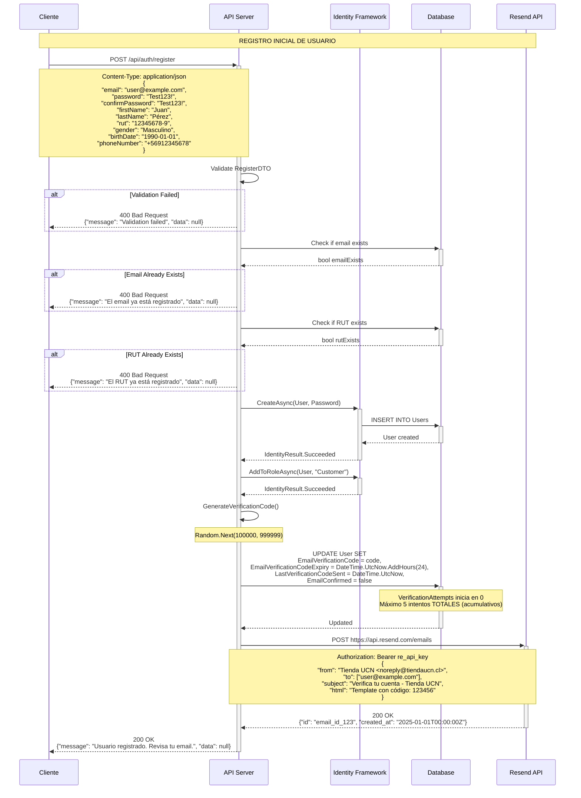

```mermaid
sequenceDiagram
    participant C as Cliente
    participant API as API Server
    participant IM as Identity Framework
    participant DB as Database
    participant R as Resend API

    Note over C,R: REGISTRO INICIAL DE USUARIO

    C->>+API: POST /api/auth/register
    Note over C,API: Content-Type: application/json<br/>{<br/>  "email": "user@example.com",<br/>  "password": "Test123!",<br/>  "confirmPassword": "Test123!",<br/>  "firstName": "Juan",<br/>  "lastName": "Pérez",<br/>  "rut": "12345678-9",<br/>  "gender": "Masculino",<br/>  "birthDate": "1990-01-01",<br/>  "phoneNumber": "+56912345678"<br/>}

    API->>API: Validate RegisterDTO
    alt Validation Failed
        API-->>C: 400 Bad Request<br/>{"message": "Validation failed", "data": null}
    end

    API->>+DB: Check if email exists
    DB-->>-API: bool emailExists
    alt Email Already Exists
        API-->>C: 400 Bad Request<br/>{"message": "El email ya está registrado", "data": null}
    end

    API->>+DB: Check if RUT exists
    DB-->>-API: bool rutExists
    alt RUT Already Exists
        API-->>C: 400 Bad Request<br/>{"message": "El RUT ya está registrado", "data": null}
    end

    API->>+IM: CreateAsync(User, Password)
    IM->>+DB: INSERT INTO Users
    DB-->>-IM: User created
    IM-->>-API: IdentityResult.Succeeded

    API->>+IM: AddToRoleAsync(User, "Customer")
    IM-->>-API: IdentityResult.Succeeded

    API->>API: GenerateVerificationCode()
    Note over API: Random.Next(100000, 999999)

    API->>+DB: UPDATE User SET<br/>EmailVerificationCode = code,<br/>EmailVerificationCodeExpiry = DateTime.UtcNow.AddHours(24),<br/>LastVerificationCodeSent = DateTime.UtcNow,<br/>EmailConfirmed = false
    Note over DB: VerificationAttempts inicia en 0<br/>Máximo 5 intentos TOTALES (acumulativos)
    DB-->>-API: Updated

    API->>+R: POST https://api.resend.com/emails
    Note over API,R: Authorization: Bearer re_api_key<br/>{<br/>  "from": "Tienda UCN <noreply@tiendaucn.cl>",<br/>  "to": ["user@example.com"],<br/>  "subject": "Verifica tu cuenta - Tienda UCN",<br/>  "html": "Template con código: 123456"<br/>}

    R-->>-API: 200 OK<br/>{"id": "email_id_123", "created_at": "2025-01-01T00:00:00Z"}

    API-->>-C: 200 OK<br/>{"message": "Usuario registrado. Revisa tu email.", "data": null}
```
