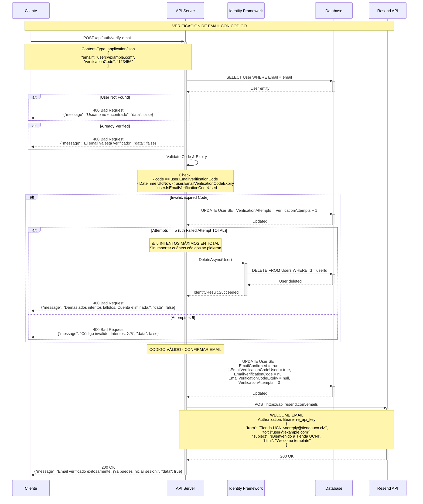

```mermaid
sequenceDiagram
    participant C as Cliente
    participant API as API Server
    participant IM as Identity Framework
    participant DB as Database
    participant R as Resend API

    Note over C,R: VERIFICACIÓN DE EMAIL CON CÓDIGO

    C->>+API: POST /api/auth/verify-email
    Note over C,API: Content-Type: application/json<br/>{<br/>  "email": "user@example.com",<br/>  "verificationCode": "123456"<br/>}

    API->>+DB: SELECT User WHERE Email = email
    DB-->>-API: User entity

    alt User Not Found
        API-->>C: 400 Bad Request<br/>{"message": "Usuario no encontrado", "data": false}
    end

    alt Already Verified
        API-->>C: 400 Bad Request<br/>{"message": "El email ya está verificado", "data": false}
    end

    API->>API: Validate Code & Expiry
    Note over API: Check:<br/>- code == user.EmailVerificationCode<br/>- DateTime.UtcNow < user.EmailVerificationCodeExpiry<br/>- !user.IsEmailVerificationCodeUsed

    alt Invalid/Expired Code
        API->>+DB: UPDATE User SET VerificationAttempts = VerificationAttempts + 1
        DB-->>-API: Updated

        alt Attempts == 5 (5th Failed Attempt TOTAL)
            Note over API: ⚠️ 5 INTENTOS MÁXIMOS EN TOTAL<br/>Sin importar cuántos códigos se pidieron
            API->>+IM: DeleteAsync(User)
            IM->>+DB: DELETE FROM Users WHERE Id = userId
            DB-->>-IM: User deleted
            IM-->>-API: IdentityResult.Succeeded

            API-->>C: 400 Bad Request<br/>{"message": "Demasiados intentos fallidos. Cuenta eliminada.", "data": false}
        else Attempts < 5
            API-->>C: 400 Bad Request<br/>{"message": "Código inválido. Intentos: X/5", "data": false}
        end
    end

    Note over API: CÓDIGO VÁLIDO - CONFIRMAR EMAIL

    API->>+DB: UPDATE User SET<br/>EmailConfirmed = true,<br/>IsEmailVerificationCodeUsed = true,<br/>EmailVerificationCode = null,<br/>EmailVerificationCodeExpiry = null,<br/>VerificationAttempts = 0
    DB-->>-API: Updated

    API->>+R: POST https://api.resend.com/emails
    Note over API,R: WELCOME EMAIL<br/>Authorization: Bearer re_api_key<br/>{<br/>  "from": "Tienda UCN <noreply@tiendaucn.cl>",<br/>  "to": ["user@example.com"],<br/>  "subject": "¡Bienvenido a Tienda UCN!",<br/>  "html": "Welcome template"<br/>}

    R-->>-API: 200 OK

    API-->>-C: 200 OK<br/>{"message": "Email verificado exitosamente. ¡Ya puedes iniciar sesión!", "data": true}
```
