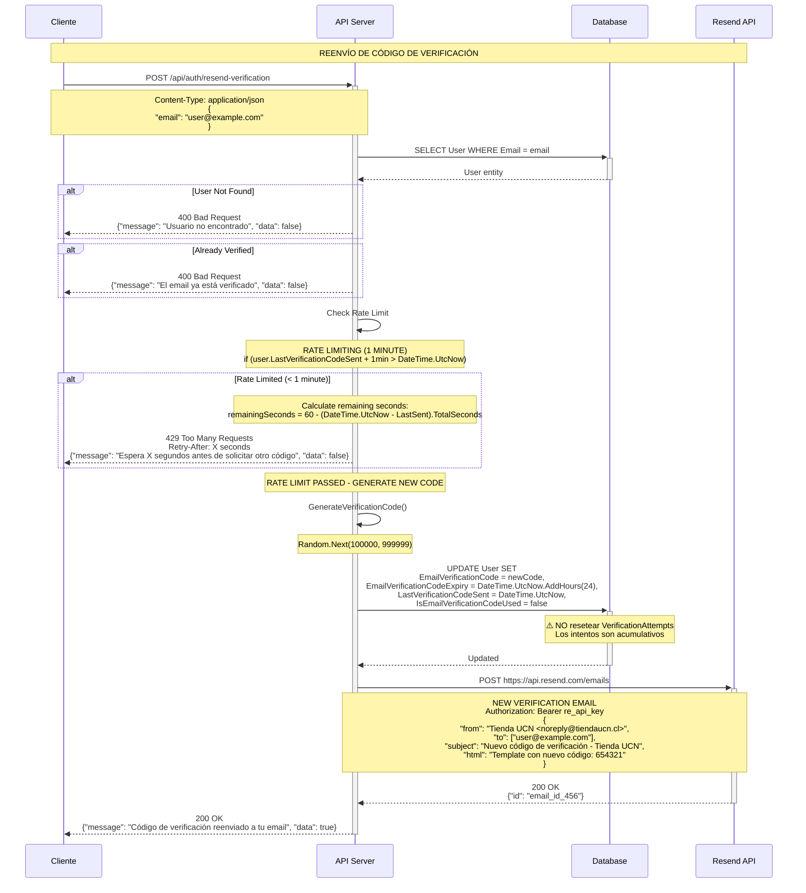

```mermaid
sequenceDiagram
    participant C as Cliente
    participant API as API Server
    participant DB as Database
    participant R as Resend API

    Note over C,R: REENVÍO DE CÓDIGO DE VERIFICACIÓN

    C->>+API: POST /api/auth/resend-verification
    Note over C,API: Content-Type: application/json<br/>{<br/>  "email": "user@example.com"<br/>}

    API->>+DB: SELECT User WHERE Email = email
    DB-->>-API: User entity

    alt User Not Found
        API-->>C: 400 Bad Request<br/>{"message": "Usuario no encontrado", "data": false}
    end

    alt Already Verified
        API-->>C: 400 Bad Request<br/>{"message": "El email ya está verificado", "data": false}
    end

    API->>API: Check Rate Limit
    Note over API: RATE LIMITING (1 MINUTE)<br/>if (user.LastVerificationCodeSent + 1min > DateTime.UtcNow)

    alt Rate Limited (< 1 minute)
        Note over API: Calculate remaining seconds:<br/>remainingSeconds = 60 - (DateTime.UtcNow - LastSent).TotalSeconds

        API-->>C: 429 Too Many Requests<br/>Retry-After: X seconds<br/>{"message": "Espera X segundos antes de solicitar otro código", "data": false}
    end

    Note over API: RATE LIMIT PASSED - GENERATE NEW CODE

    API->>API: GenerateVerificationCode()
    Note over API: Random.Next(100000, 999999)

    API->>+DB: UPDATE User SET<br/>EmailVerificationCode = newCode,<br/>EmailVerificationCodeExpiry = DateTime.UtcNow.AddHours(24),<br/>LastVerificationCodeSent = DateTime.UtcNow,<br/>IsEmailVerificationCodeUsed = false
    Note over DB: ⚠️ NO resetear VerificationAttempts<br/>Los intentos son acumulativos
    DB-->>-API: Updated

    API->>+R: POST https://api.resend.com/emails
    Note over API,R: NEW VERIFICATION EMAIL<br/>Authorization: Bearer re_api_key<br/>{<br/>  "from": "Tienda UCN <noreply@tiendaucn.cl>",<br/>  "to": ["user@example.com"],<br/>  "subject": "Nuevo código de verificación - Tienda UCN",<br/>  "html": "Template con nuevo código: 654321"<br/>}

    R-->>-API: 200 OK<br/>{"id": "email_id_456"}

    API-->>-C: 200 OK<br/>{"message": "Código de verificación reenviado a tu email", "data": true}
```
